# imortal vampires spawning frankenstains

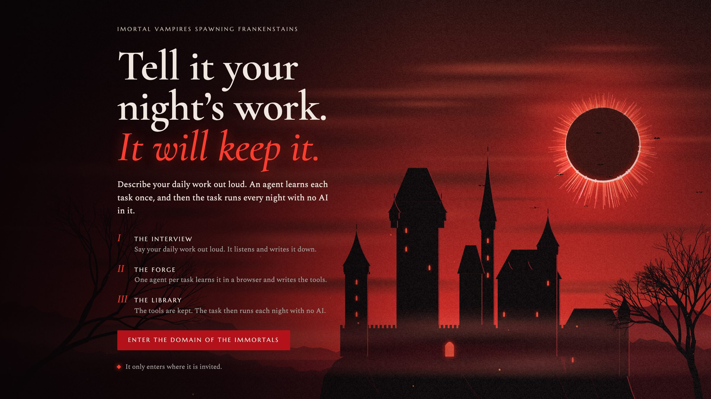

**You describe your daily work out loud. An AI agent learns each task once, writes its own tools to do it, and from then on the task runs every night with no AI in it.**

Hackathon entry for the Frankenstein topic (From Dusk Till Dawn #01, Prague): an agent that builds its own capabilities, tests them, installs them and uses them again later.

- **See the web app:** <https://imortal-vampires-spawning-frankensteins-310bhu8or.vercel.app/>. This is a sample address whose only purpose is to demonstrate the web app. Everything on it is simulated data, marked "Simulated data" on every screen: no lab service, no agents and no real systems are behind it, and it is not the system that produced the results below.
- **How we meet each criterion, with evidence:** [Criteria.md](Criteria.md)
- **What it costs and what it saves:** [ECONOMY.md](ECONOMY.md)
- **Recorded agent sessions, unedited except for the host name:** [`evidence/`](evidence)

## The whole process

1. **The interview.** A person talks to a voice agent (ElevenLabs) for a few minutes about what they do every day: what starts a task, which systems they open, what they type, how they know it worked. The agent only listens and asks; it has no tools and can do nothing.
2. **The proposal.** One read-only model call turns the transcript into a list of processes, each with its steps, its schedule and the systems it needs. Tasks that need a system nobody configured are left out.
3. **The invitation.** The person chooses which systems the agents may enter and with which login. This is the only access they will ever have. A tool that reaches for anything else is stopped and listed under "Refused".
4. **The Forge.** One agent per process, a "monster", starts with no tool for the task. It looks at the shared Library, takes what fits, and writes the small tools that are missing by doing the task in a real browser you can watch. It tests each tool as it goes.
5. **The lab's own check.** The lab runs the finished chain of tools on a second example the monster never saw, in a sandbox, with no model. If it fails, the tools that monster made are taken off the shelf.
6. **The seal.** The person reads the result and confirms it. Nothing runs on a schedule before that.
7. **Every night after.** The sealed process runs as plain code: no model call, no tokens, seconds per item.
8. **Repair.** When a tool breaks, for example because a site renamed a button, the run fails, a new monster is given that one tool and the failed item, writes the next version, and the lab reruns the item. If it passes, the process is sealed again without anyone asking.
9. **The Library grows.** Every tool is kept with its versions. The next process, learned by a fresh agent with no memory of the first, finds those tools and reuses them.

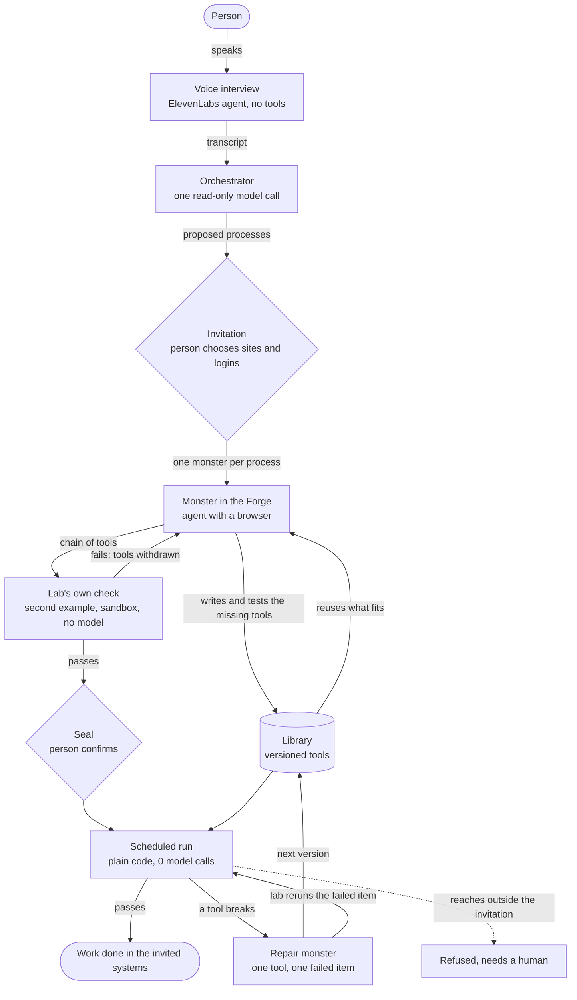

The model is used in three places only: reading the interview, learning a process, and repairing a tool. It is never used to run one.

## What happened on the night

All of this ran through the web app and the lab service against a live HR system (OrangeHRM), with work arriving as emails.

| What | Result |
| --- | --- |
| "New hire" learned from an empty Library | Six tools written. The lab's check passed on a second email. Sealed. 11 minutes. |
| "Leave requests" learned by a fresh agent | Reused two of the first agent's tools, wrote three new ones. Sealed. 18 minutes. |
| A sealed process run on new emails | "New hire" ran on two later emails and passed both, in 25 and 43 seconds, with 0 model calls. |
| A sealed run failed and repaired itself | The tool could not find a button. A repair monster wrote version 2 in about three and a half minutes, the failed email was rerun with 0 model calls and passed, and the process sealed itself again. |
| "Leavers", the third process | **Not learned.** Its agent was stopped at the 20-minute limit before its chain passed. |

The button in the repair was renamed by us, by hand, to stand in for a site that changed. That is the only hand edit to generated code, and it is declared wherever the repair is shown. What is still unproven is listed at the end of [Criteria.md](Criteria.md).

## Screenshots

Taken from the running app on the night, with real data. The HR system's address is replaced by `hr.example` in these pictures.

| | |
| --- | --- |
| **The interview.** The eye is the voice button; the right page takes typing. 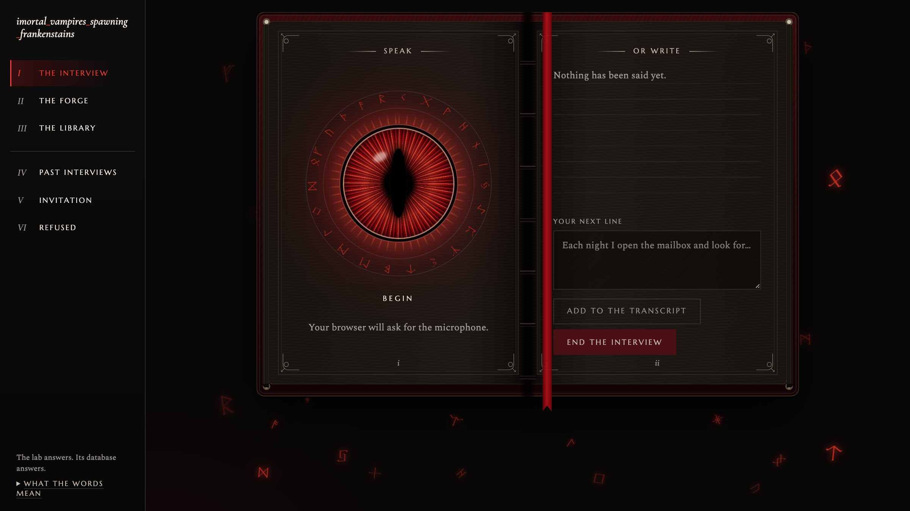 | **What it heard.** The processes proposed from one interview, before anything is invited. 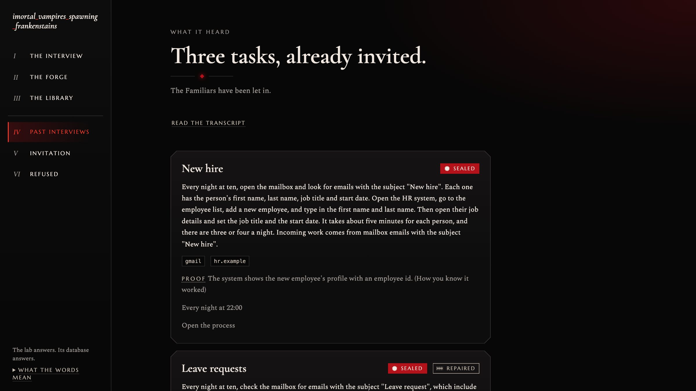 |
| **The invitation.** The only places anything may reach. 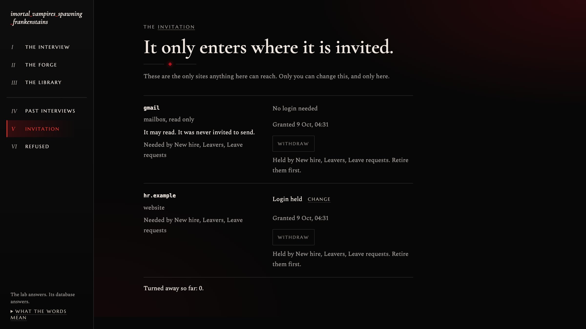 | **The Forge.** Agents at work, and the sealed processes below. 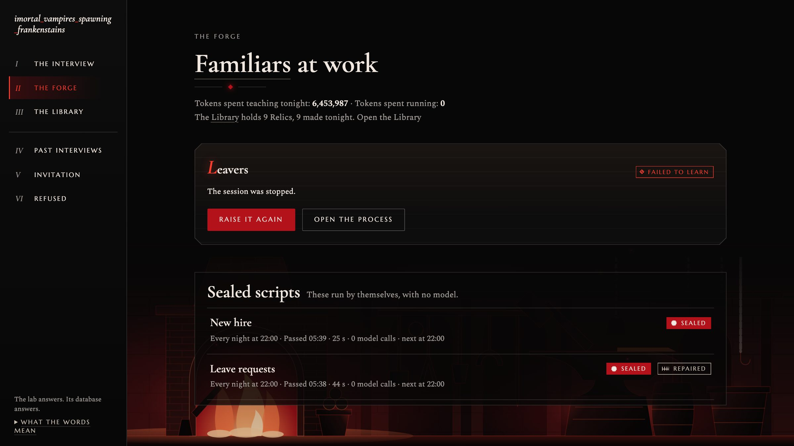 |
| **The Library.** Every tool the agents wrote, one book each. 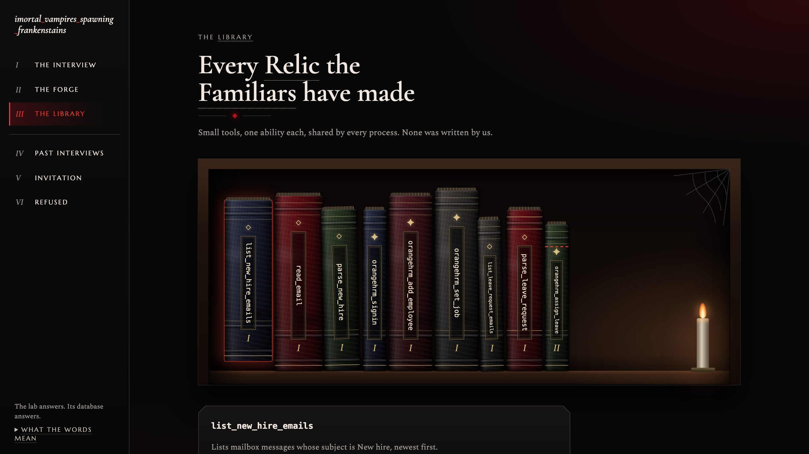 | **One tool.** Its versions and its repair. 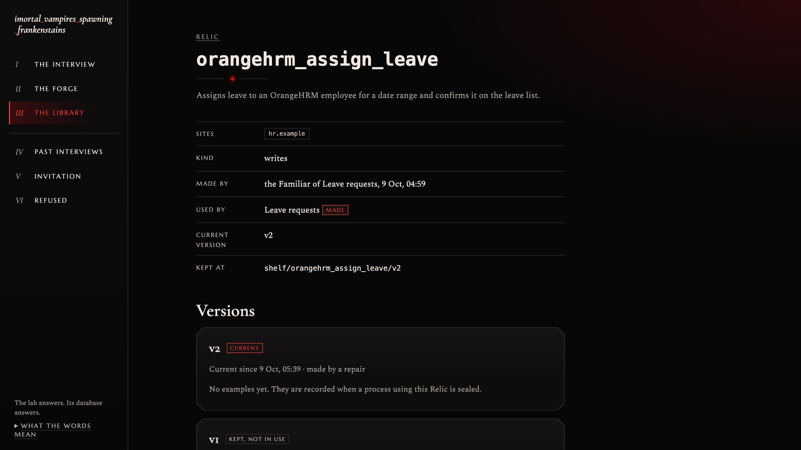 |
| **A sealed process.** Two failed runs, then the run after the repair. 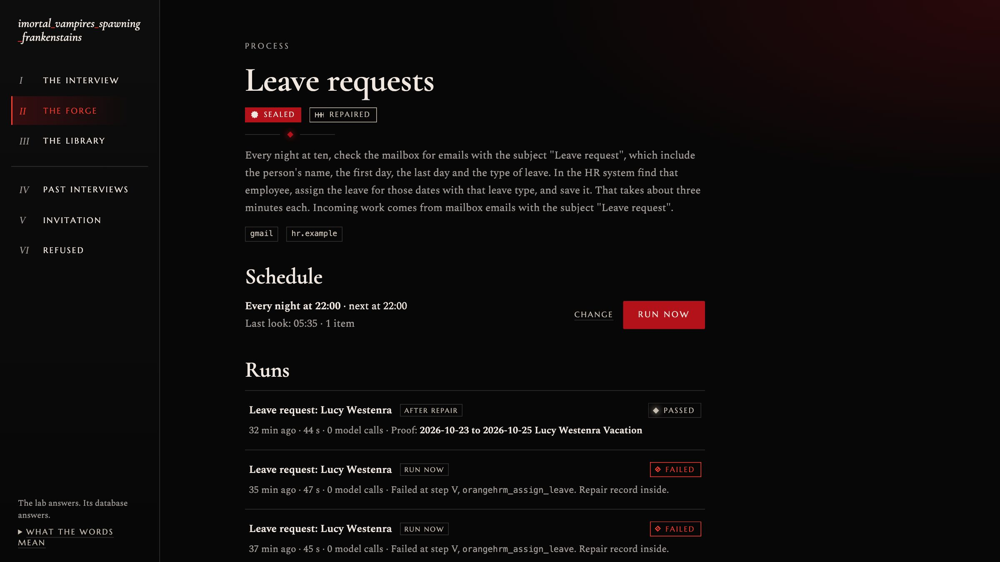 | **The run after the repair.** Each step, with no model calls. 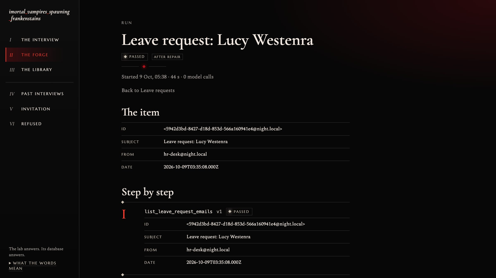 |

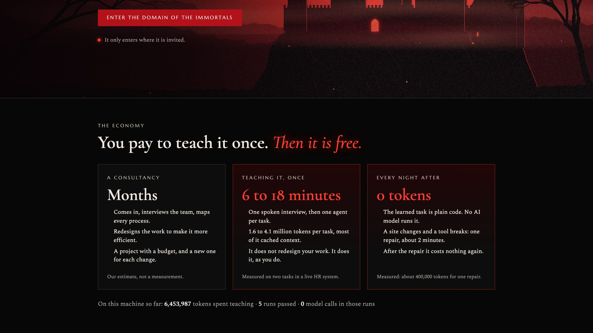

## The pitch

**What this repository shows is possible.** An agent does not have to be in the loop every time work is done. It can be the thing that *builds* the loop: it watches a task once, turns it into small tested tools, and then gets out of the way. After that the work is ordinary code, which is cheap, fast, and does the same thing every night. The agent comes back only when something breaks, and then it repairs one tool and leaves again. Its abilities grow with every task. Its access does not: it only enters where it is invited.

**Why that matters.** Most "AI agents at work" pay for a model on every single item, forever, and behave a little differently each time. Most automation projects need someone to map the process, write the integration and maintain it. This sits between the two: the description is a conversation, the integration is written by the agent, and the result has no model in it.

**Where the money is.** Learning a task cost about two dollars of tokens tonight, at assumed list prices, and under twenty minutes. Running it afterwards costs nothing in tokens. By the figures the person gave in the interview, the task we learned takes them about 73 hours a year. [ECONOMY.md](ECONOMY.md) has the arithmetic, the assumptions, and what we did not count. A product built on this would charge for sealed processes that keep running, not for tokens.

**It is not tied to this HR system.** OrangeHRM was the system we had a sandbox for. Nothing in the product code names it: the agents learned it by using it. Any system a person works in through a browser and a login could stand in its place, such as Shopify, SAP or an internal admin tool. We have not tried those, so treat this as the design, not as a result.

**It is not tied to one person.** The interview covers one person's tasks today. The same interview could be given to every member of a team, or of a company, and the Library is already shared: a tool one agent writes for one person's task is found by the agent learning a colleague's. Many interviews feeding one Library is the natural next step, and it is not built or tested.

**What it does not do.** It does not redesign your work or make the process better. It does the task the way you described it. Sometimes that is the wrong thing to automate, and a person still has to decide that.

## Use of ElevenLabs

The interview is a live spoken conversation with an ElevenLabs conversational agent (`scripts/create-interview-agent.mjs` creates it and holds its prompt).

- It asks one question at a time and lets the person talk: what starts the task, which systems, what is read and typed, how they know it worked, how long and how often.
- It reads back what it heard and asks if that is right before it ends.
- It has **no tools**, so nothing said in the conversation can cause an action. It is told never to ask for a password and to stop a person who starts to say one.
- The transcript goes to the orchestrator; a spoken interview and a typed one take the same path.
- The voice button on the interview page is an eye that opens while it listens.

Typing works wherever voice does not, so the product never depends on a microphone.

## How it was built, and what inspired it

Built in one night by one person, working with several AI coding agents in parallel (they are credited as co-authors in the commit history). The agents wrote the product. They did not write any of the task tools: those are written at run time by the monsters and are not in this repository.

**About the model behind the monsters.** The intended design is Claude through the Anthropic API, called directly, so that the model, its price and its token limits are ours to choose. There were no free API credits for that on the night, so the monsters run on the one option that was available: the Cursor command-line agent with its model set to "auto". The consequences are real and are listed where they matter: we do not know which model did the work, tokens are reported only when a session ends and so cannot be capped while it runs, and a provider filter once refused a harmless brief. The part that calls the model is one seam (`apps/lab/src/monster`), so changing it does not touch the rest.

The look of it, the castle, the blood-red eclipse, the forge, the library of old books, was inspired by *Castlevania*, which was playing while this was being made.

## Against the assignment

A short scorecard. [Criteria.md](Criteria.md) has the example and the evidence behind every line.

### The four hard rules

| Rule | Status | How |
| --- | --- | --- |
| Generated code runs in a sandbox, never on a host holding your credentials | **Partly met** | Every tool, in every test, check, run and rerun, executes in a worker process started inside the macOS system sandbox (`apps/lab/src/runner/sandbox.ts`, tested in `sandbox.test.ts`). The profile denies it the project's `.env`, the lab's held logins, the usual credential folders in the home directory, and every write outside scratch space. A tool is handed only its input, the login for the sites it declared, and its connectors. Not met: it is the same machine, not a container; the profile is a deny-list; it exists on macOS only, and elsewhere the worker is an ordinary process. The monster's own agent session is not sandboxed at all. |
| No install without passing tests; the test run is visible in the log | **Met, with one detail** | A tool is placed on the shelf after a static check so that the lab can run it. The lab then runs the whole chain on a second example with no model. If that run fails, every tool that monster created is removed again. The check lines and the run are shown on the process page. |
| The gap comes from a task | **Met** | Tasks come from the interview. No code names a tool to build or a site to build it for. The shelf starts empty; see it before the first run on the Library page. |
| Self-iterations and spend per run are capped in code | **Partly met** | Capped: 20 minutes per monster (`LAB_MONSTER_TIMEOUT_MS`), 3 learn attempts and 3 repairs per process (`LAB_MAX_ATTEMPTS`), 3 monsters at once, 120 seconds per run. Not capped: tokens. The agent reports them only when a session ends, so they are recorded, not limited. |

### The definition of done

| Asked for | Status | Where |
| --- | --- | --- |
| A task exposes a missing capability; the agent creates, tests and registers it, then completes the task | Met | "New hire" was learned from an empty shelf and sealed |
| A fresh session, on a different task, combines earlier capabilities without rebuilding | Met | Each monster is a new session. "Leave requests" reused the sign-in and read-email tools that "New hire" made |
| A persistent registry with versions and rollback | Partly | Every tool keeps every version. A failed repair is rolled back automatically. There is no button to roll back by hand |
| The agent builds its own discovery and management tooling | Not met | The agent writes each tool's description and interface, which is what the shelf search reads. The shelf and its search are ours |
| An approval gate, operator control | Met | Nothing runs on a schedule until you seal it. You invite sites, set the schedule, resume and retire |
| Eyes, hands or a voice | Met | A browser it drives; an ElevenLabs voice interview |

## Starting kit list

The team wrote no task tools, and the shelf starts empty. This is everything a monster is born with; none of it is specific to any site or task:

- **Read the shelf** — list every tool: name, description, sites, input, output (`./kit shelf`)
- **Search the shelf** by words (`./kit search <words>`)
- **Create a tool** — write `tools/<name>/meta.json` and `tools/<name>/tool.mjs`
- **Test a tool** on one input (`./kit test <tool> '<input json>'`)
- **Run a draft chain** on one item (`./kit chain`)
- **Generic browser actions** — open, click, type, read the page

The kit is in `apps/lab/src/monster/kit.ts`, and the words a monster is handed with it are in `apps/lab/src/monster/briefs.ts`.

## Stack

Turborepo monorepo. The web app talks only to the lab service; with the service off it shows an in-browser simulation, marked "Simulated data". Turborepo and pnpm; Next.js (App Router), React and Tailwind v4 in `apps/web`; Fastify and Playwright in `apps/lab`; Postgres in Docker with Kysely for queries, migrations and schema types in `packages/db`.

## The real / simulated / missing table

| Feature | Status | Notes |
|---------|--------|-------|
| Web app screens and routes | Real | Next.js frontend |
| Database | Real | Postgres with Kysely schema and migrations |
| Lab service core | Real | Fastify service: interviews, processes, invitation, runs, ticks, events |
| Mock mode data | Simulated | By default the web app uses an in-browser simulation kept in `sessionStorage`, marked "Simulated data" |
| Test emails | Simulated | Sent by `scripts/send-test-emails.mjs` to a throwaway mailbox |
| Runner (runs a chain with no model) | Real | `apps/lab/src/runner`. Runs every saved chain, the lab's own check after learning, and the rerun after a repair. Covered by tests, including one through the service. |
| Install check (shelf) | Real | `apps/lab/src/shelf`. Every tool a monster writes passes it before it is installed. |
| Monster (learns and repairs) | Real | `apps/lab/src/monster`, driven through the `cursor-agent` command. Learned two processes, reused tools between them and repaired one, through the lab service. |
| Scheduling | Real | `apps/lab/src/scheduling`: daily at a time, or every N minutes. |
| Orchestrator (reads the interview) | Real | `apps/lab/src/orchestrator`: one read-only agent call that turns a transcript into proposed processes, limited to the configured systems. |
| Mailbox connector | Real | `apps/lab/src/connectors`: read-only search and read over IMAP. Anything but those two actions is refused. |
| Mailbox | Simulated | A local mail server in Docker (`docker-compose.yml`), filled by `scripts/send-test-emails.mjs`. The connector reads it over the same protocol a real mailbox uses; pointing it at Gmail needs only an app password in `.env`. |
| ElevenLabs voice interview | Real | Live conversation with an ElevenLabs agent. It needs an agent id in `.env`; without one the voice button is off and typing still works. |

## Layout

- `apps/web` — Next.js app (App Router, Tailwind v4)
- `apps/lab` — Fastify lab service on `http://localhost:4000`, plus the standalone runner
- `packages/contract` — the types the web app and the lab service share (`@repo/contract`); do not change casually, see its README
- `packages/db` — Kysely client, migrations and generated schema types (`@repo/db`)

## How to run

```sh
nvm use                 # Node 24, from .nvmrc
corepack enable         # pnpm version comes from package.json
pnpm install
cp .env.example .env
pnpm db:up              # Postgres in Docker on localhost:5434
pnpm db:migrate
pnpm dev                # http://localhost:3000
```

After the first setup, one command starts everything:

```sh
pnpm dev:all            # Postgres, migrations, then every app in dev mode
```

`pnpm dev:all` runs `pnpm db:up`, `pnpm db:migrate` and `pnpm dev` in that order and stops at the first one that fails. It is safe to run while Postgres is already up. Because it ends in `turbo run dev`, any package that later gains a `dev` script (for example the lab service) is started by it with no change to the script. It needs Docker running and Node 24.

The web app has no database access and no health route of its own. It shows the lab service's health (`GET /health` on `http://localhost:4000`) in the footer of every screen. `pnpm dev` starts the web app and the lab service. The database is required by the lab service.

### Scripts

| Command                       | What it does                                             |
| ----------------------------- | -------------------------------------------------------- |
| `pnpm dev`                    | Run all apps in dev mode                                 |
| `pnpm dev:all`                | Start Postgres, apply migrations, then run `pnpm dev`    |
| `pnpm build`                  | Build everything                                         |
| `pnpm lint`                   | ESLint                                                   |
| `pnpm typecheck`              | TypeScript across the workspace                          |
| `pnpm format`                 | Prettier                                                 |
| `pnpm db:up` / `pnpm db:down` | Start / stop Postgres                                    |
| `pnpm db:migrate:make <name>` | Create a migration in `packages/db/migrations`           |
| `pnpm db:migrate`             | Apply pending migrations                                 |
| `pnpm db:migrate:down`        | Roll back the last migration                             |
| `pnpm db:codegen`             | Regenerate `packages/db/src/schema.ts` from the database |

After changing the schema: `pnpm db:migrate && pnpm db:codegen`.

## Web app

Routes: `/` (the landing page with the castle and the economy), `/interview` (the spell book), `/interviews` and `/interviews/[id]` (review and invite), `/lab` (the Forge), `/processes/[id]`, `/processes/[id]/runs/[runId]`, `/reliquary` and `/reliquary/[name]` (the Library), `/invitation`, `/refused`.

Every screen reaches the lab service through one client interface (`apps/web/src/lib/lab/client.ts`) with two implementations:

- **mock** (default): an in-browser simulation seeded with the reference scenarios. No service needs to run. A "Simulated data" marker is shown on every screen; it also lets you start a scenario again or cut the line to the lab to see the dropped-connection state. The made-up records live in the browser tab (`sessionStorage`) and survive a reload.
- **http**: the real lab service. Set `NEXT_PUBLIC_LAB_MOCK=0`.

Mock scenarios, chosen with `?mock=` on any URL and remembered for the tab:

| URL            | Starts with                                                                                                                                 |
| -------------- | ------------------------------------------------------------------------------------------------------------------------------------------- |
| `/?mock=empty` | Nothing at all: the first run, Library empty. Type an interview (eight words or more) to hear three processes.                            |
| `/?mock=story` | The default. One interview that is being read; about seven seconds later its three processes are proposed.                                  |
| `/?mock=full`  | A night already behind us: sealed and repaired, needs a human, awaiting a Seal, a Familiar learning live, queued, failed to learn, retired. |

Playing the story in the mock: invite and start → watch the Lab → "Review and seal" → Seal → "Run now" three times on the first process (a pass, then a failure that repairs itself, then a refused site that needs a human) → Resume. In the simulated interview, fewer than eight typed words gives "It heard no process in that", and a line containing "cannot be read" gives the could-not-read state.

| Variable                          | Default                 | Meaning                                                                        |
| --------------------------------- | ----------------------- | ------------------------------------------------------------------------------ |
| `NEXT_PUBLIC_LAB_MOCK`            | on (unset or `1`)       | `0` turns the simulation off and calls the lab service.                        |
| `NEXT_PUBLIC_LAB_URL`             | `http://localhost:4000` | Address of the lab service. It must allow requests from the web app's origin.  |
| `NEXT_PUBLIC_ELEVENLABS_AGENT_ID` | unset                   | Public ElevenLabs agent id. Unset: the voice button is disabled, typing works. |

`NEXT_PUBLIC_*` values are read when the app is built or the dev server starts, so restart after changing them.

## Environment

A single `.env` at the repo root is shared by the web app, the lab service and the db tooling.
